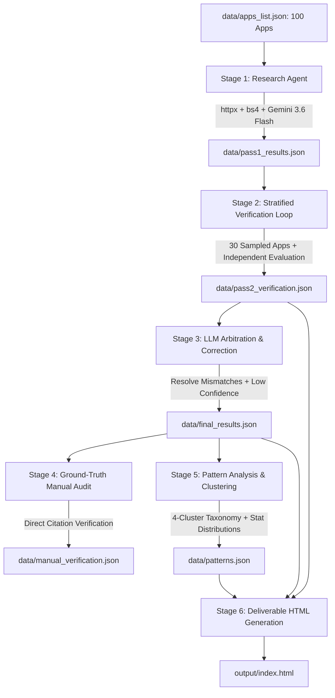

# Composio AI Product Ops: 100-App Research Agent & Case Study

An autonomous research pipeline and interactive case study evaluating 100 enterprise, developer, and consumer applications across 10 categories for AI agent tool and MCP (Model Context Protocol) buildability.

---

## Executive Summary

Composio turns software applications into agent-callable tools. Before building integration toolkits for any platform, rigorous operational research is required to evaluate:
- **Authentication topologies**: OAuth2 vs API Keys vs Session vs Token-based auth
- **Self-service viability**: Instant developer onboarding vs sales/partner gating
- **API surface coverage**: REST, GraphQL, WebSocket interfaces and endpoint breadth
- **Model Context Protocol (MCP)**: Pre-existing MCP servers vs custom implementation needs
- **Agent buildability verdicts**: Immediate readiness, minor blockers, or non-viable architectures

This project implements an autonomous multi-stage research agent with real verification loops, browser-use inspection, arbitration corrections, pattern clustering, and an interactive case study deliverable.

---

## Repository Architecture

```
composio/
├── agent/
│   ├── __init__.py           # Agent package initialization
│   ├── researcher.py         # Stage 1: Async/HTTP document retrieval & 13-field LLM extraction
│   ├── analyzer.py           # Stage 4: Statistical aggregation, 4-cluster taxonomy, & pattern insights
│   └── html_generator.py     # Stage 5: Self-contained interactive Case Study HTML report
├── data/
│   ├── apps_list.json        # 100 apps across 10 categories with hint URLs and metadata
│   ├── pass1_results.json    # Initial research extraction output
│   ├── pass2_verification.json # Cross-verified stratified sample (30 apps)
│   ├── pass3_corrected.json  # Arbitrated corrections for mismatches & low-confidence apps
│   ├── final_results.json    # Final consolidated dataset across all 100 applications
│   ├── manual_verification.json # Ground-truth human audit logs with doc citations
│   └── patterns.json         # Cluster groupings, distributions, and headline findings
├── output/
│   └── index.html            # The single deliverable case study page (deployable to GitHub Pages)
├── config.py                 # Central configuration, Gemini SDK settings, and prompts
├── requirements.txt          # Production dependencies
├── run_agent.py              # CLI orchestrator supporting modular or end-to-end pipeline execution
└── README.md                 # Setup guide, methodology, and architectural documentation
```

---

## 5-Stage Agent Pipeline



### Stage 1: Research Extraction (`agent/researcher.py`)
- Evaluates candidate developer portals, API documentation paths, and subdomain fallbacks.
- Cleans and strips HTML payloads, extracting semantic documentation text.
- Formulates a 13-field structured extraction schema processed via Google Gemini 3.6 Flash.
- Implements exponential backoff, batching, and confidence scoring (HIGH, MEDIUM, LOW).

### Stage 2: Verification Loop (`run_agent.py --stage verify`)
- Draws a stratified sample of 30 applications (3 apps across each of the 10 distinct categories).
- Performs an independent fetch and asks the verification evaluator to evaluate pass 1 findings.
- Generates granular per-field hit/miss metrics across authentication, self-serve status, and buildability.

### Stage 3: Arbitration & Correction (`run_agent.py --stage correct`)
- Detects discrepancies between pass 1 extractions and pass 2 verification logs.
- Initiates an arbitrator prompt that compares conflicting evidence and produces an authoritative correction.
- Emits `final_results.json` ensuring clean data lineage.

### Stage 4: Ground-Truth Manual Audit (`run_agent.py --stage manual`)
- Deep-dives into edge-case applications (e.g., enterprise platforms with gated portals or anti-bot defenses).
- Captures exact documentation quotes and logs verification rationale to `data/manual_verification.json`.

### Stage 5: Pattern Clustering & Insights (`agent/analyzer.py`)
- Aggregates empirical distributions across authentication protocols, self-serve access ratios, and SDK language coverage.
- Groups all 100 apps into a 4-tier buildability taxonomy:
  1. **Ready Today**: Public REST/GraphQL APIs with instant self-service access.
  2. **Quick Win**: Self-serve API with minimal documentation friction or SDK gaps.
  3. **Needs Outreach**: Documented APIs requiring enterprise sales contact, partner approval, or admin whitelisting.
  4. **Not Feasible Now**: Closed proprietary systems or platforms lacking public programmatic interfaces.

### Stage 6: Interactive Case Study Deliverable (`agent/html_generator.py`)
- Produces a single, self-explanatory `output/index.html`.
- Incorporates real-time multi-column search, category filtering, sortable tables, cluster heatmaps, and embedded JSON-LD dataset schemas for machine consumability.

---

## Quick Start & Reproduction

### 1. Prerequisites
- Python 3.10+ (tested on Python 3.13)
- Google Gemini API key

### 2. Environment Setup
```bash
# Clone the repository
git clone https://github.com/your-username/composio-app-research.git
cd composio-app-research

# Create and activate virtual environment
python -m venv venv
# On Windows:
.\venv\Scripts\activate
# On macOS/Linux:
source venv/bin/activate

# Install required packages
pip install -r requirements.txt
```

### 3. Configure API Credentials
```bash
# Set your Gemini API key in your environment
# On Windows (PowerShell):
$env:GEMINI_API_KEY="your-gemini-api-key"
# On macOS/Linux:
export GEMINI_API_KEY="your-gemini-api-key"
```

### 4. Running the Pipeline
You can execute the entire pipeline end-to-end or run specific stages:

```bash
# Run the complete pipeline (Stages 1 through 6)
python run_agent.py --stage all

# Run only research on specific apps (e.g., App IDs 1, 21, 61)
python run_agent.py --stage research --apps 1,21,61

# Run verification and corrections on existing research data
python run_agent.py --stage verify
python run_agent.py --stage correct

# Re-generate pattern analysis and HTML deliverable
python run_agent.py --stage analyze
python run_agent.py --stage html
```

---

## Deployment Instructions

The final deliverable is located at `output/index.html`. To deploy as a live URL via GitHub Pages:
1. Initialize Git and commit all project files:
   ```bash
   git init
   git add .
   git commit -m "feat: complete Composio 100-app research agent and deliverable"
   ```
2. Push to your GitHub repository:
   ```bash
   git remote add origin https://github.com/your-username/composio-app-research.git
   git branch -M main
   git push -u origin main
   ```
3. Enable GitHub Pages in repository settings:
   - Navigate to **Settings** > **Pages**.
   - Under **Build and deployment** > **Source**, choose **Deploy from a branch**.
   - Select branch `main` and folder `/output` (or root if moved), then click **Save**.

---

## License
MIT License
